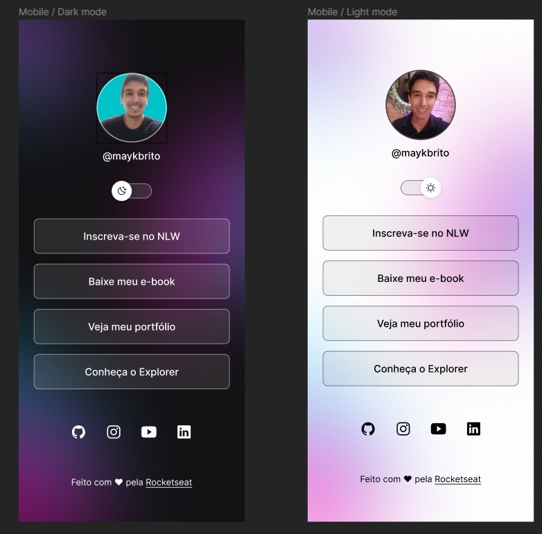

<h1 align="center">DevLinks</h1> 

 
Evento exclusivo e gratuito, promovido peça Rocketseat para
ensino de tecnologias WEB.

 
    <a href="#-tecnologias">Tecnologias</a>&nbsp;&nbsp;&nbsp;|&nbsp;&nbsp;&nbsp;
    <a href="#-projeto">Projeto</a>&nbsp;&nbsp;&nbsp;|&nbsp;&nbsp;&nbsp;
    <a href="#-layout">Layout</a>&nbsp;&nbsp;&nbsp;|&nbsp;&nbsp;&nbsp;
    <a href="memo-licença">Licença</a>

    

## 🚀 Tecnologias

Esse projeto foi desenvolvido com as seguintes tecnologias:

 - HTML e CSS
 - JavaScript
 - Git e Github

## 💻 Projeto

O projeto foi a criação de um portifólio com links.
